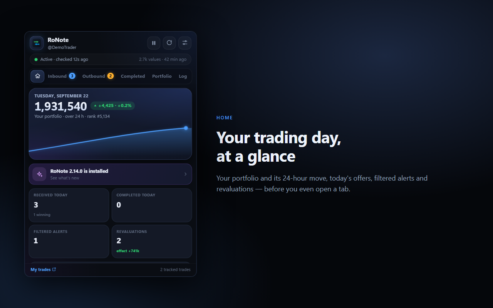
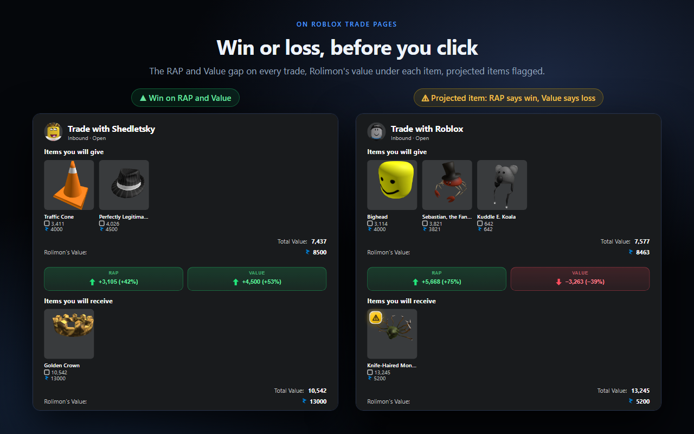
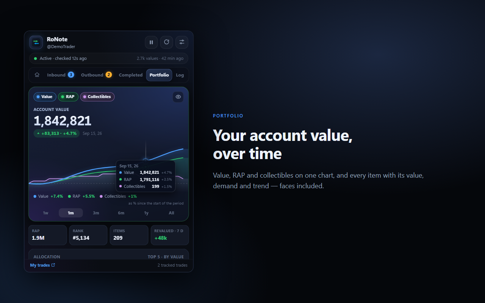
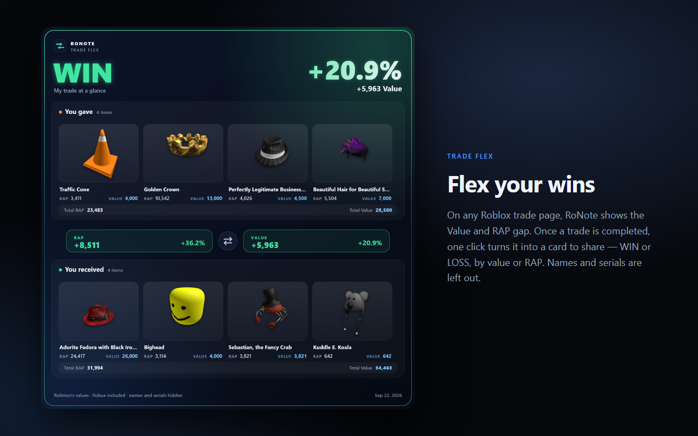

# RoNote — Roblox trade alerts & values

**English** · *[Français](README.fr.md)*

[](LICENSE)
[](CHANGELOG.md)
[](https://github.com/cpu-alt/RoNote/actions/workflows/tests.yml)

A browser extension (Chrome / Edge / Brave / Opera / Firefox) that tells you on your
desktop about **everything that happens in your Roblox trades**: a new inbound
trade, a completed trade, a **counter-offer**, one of your offers **accepted /
declined / countered / expired**, or a trade cancelled by a **Roblox error**
("Rejected due to an error").

The core promise: **zero false alerts.** Tracking never relies on usernames, list
positions or trade counts — only on each trade's **unique ID**.

And the number that matters, everywhere, is the **value**, not the RAP.

<p align="center">
  
  
</p>

---

## Features

### Alerts
- **Reliable desktop notifications**, with a different sound for each kind of event —
  built-in sounds or **your own** (import an MP3, WAV, OGG or M4A)
- **Filters**: value threshold, ignored players, quiet hours
- **Revaluation alerts**: get notified when Rolimon's changes the value of an item you own
- **Decline or cancel** a trade in two deliberate clicks, from its detail view

### Value analysis
- **Every trade valued**: Rolimon's value, RAP, and Robux counted **net** of Roblox's 30% tax
- **Trap detection**: *projected* items, speculative values, faces and bundle items with no value
- **Rare items** get a small diamond, and Rolimon's **Lucky Cat** copy gets a golden cat

### On roblox.com
- **Trade pages**: a compact RAP / Value difference banner between the two offers,
  and the Rolimon's value under every item, plus each offer's total
- **Trade lists** (Inbound, Outbound, Completed): each trade's difference on the
  right of its row, without opening it
- **Limited item pages**: a **Value** row under "Best Price", with demand, trend and
  a direct link to the item's Rolimon's page
- **Your own background**: import any image as the roblox.com background, with a
  veil in your theme's colour to keep text readable, and optional blur

### Popup
- **Portfolio**: your account value and its curve, then each of your collectibles
  with its value, demand and trend (search, sort, gallery view, hideable amounts)
- **Flex my portfolio**: a card in the Trade Flex style with your value, its change
  and your Rolimon's chart — it follows the chart's period and curves
- **Flex backgrounds**: built-in images, animated backgrounds (Aurora, Stars,
  Synthwave, Bokeh) or your own image or GIF; animated cards download as a **GIF**
- **Goal**: a value or an item to reach, with or without a deadline, with your
  current pace, the pace you need and an estimated date
- **Anonymous mode** (eye button or the H key): every amount becomes a blurred fake
  number, rank and username are hidden, percentages stay visible — made for
  screen sharing and streams; the Flex card has an anonymous version too
- **Monthly recap** (Journal): value gained from trades, win rate, best trade and
  account trend, on a card to copy or download
- **Trade Flex**: a clean PNG card of a completed trade
- **Coin flip**: can't decide on a trade? Pick your chip (green R$ or orange T) and let luck decide

### Make it yours
- **Themes**: RoNote, Minimal, Neon, Sunset, Ocean and Casino set the banner, lists,
  badge and background in one click. Export your theme to a file and share it.
- **Appearance settings**: colours, style, size and format for the banner, the list
  column and the *projected* badge, with a live preview
- **English and French**, detected automatically

RoNote **never accepts** a trade and never creates one: those actions move items,
and a misplaced click would be irreversible.

<p align="center">
  
  
</p>

## Installation

### From a Release (recommended)

No tools needed — no Python, no Node.

1. Go to the [Releases](https://github.com/cpu-alt/RoNote/releases) page and download
   `ronote-chrome-vX.Y.Z.zip` (or `ronote-firefox-…` for Firefox).
2. **Unzip it** into a folder you will keep: the browser loads the extension *from
   that folder*, it does not copy it anywhere else.
3. **Chrome / Edge / Brave / Opera** — open `chrome://extensions`, turn on
   **Developer mode** (top right), click **Load unpacked** and select the unzipped folder.
4. **Firefox** (128 or later) — open `about:debugging#/runtime/this-firefox`, click
   **Load Temporary Add-on** and select `manifest.json` in the unzipped folder.

> **Why developer mode?** RoNote is not on the Chrome Web Store yet, and Chrome only
> installs extensions from elsewhere this way. Two consequences: a "Disable developer
> mode extensions" warning at startup (you can close it), and **no automatic
> updates** — to update, download the new zip and replace the folder's contents.
>
> On Firefox, a temporary add-on **is removed when the browser closes**. This is a
> Mozilla limit for unsigned extensions.

### Check that it works

Log in on `roblox.com`, then open the popup: you should see
`Active · checked Xs ago` and your username. The **Test it** button in the settings
sends a demo notification with its sound.

> On the very first run, RoNote silently records the trades that already exist:
> **no notification for what's already there**. Only trades that arrive afterwards count.

## Privacy

**No data leaves your browser.** No RoNote server, no account, no telemetry. The only
requests go to Roblox's public APIs and, if you keep the option on, to Rolimon's for
the value table — which receives nothing about you. Imported images (background,
badge) stay on your computer, and the share cards never show a username.

Full details: **[Privacy policy](PRIVACY.md)** · *[Français](PRIVACY.fr.md)*

## Building from source

**Without Node** (Python 3 is enough):

```bash
python tools/check.py
```

```bash
python tools/build.py
```

This produces `dist/chrome/`, `dist/firefox/` and the matching `.zip` files. Load
`dist/chrome` as described above; after a rebuild, the **Reload** (⟳) button in
`chrome://extensions` is enough.

**With Node**, the equivalents: `npm run check:node`, `npm run build:node`, `npm test`.
Icons are regenerated with `npm run icons`, only if you change them.

### Tests and previews

```bash
python tools/serve.py
```

Then, in a browser:

| | |
|---|---|
| <http://127.0.0.1:8777/tools/selftest.html> | the browser self-tests |
| <http://127.0.0.1:8777/tools/preview/popup.html> | the real popup, wired to a fake service worker (`?lang=en` for English) |
| <http://127.0.0.1:8777/tools/preview/options.html> | the real settings page |
| <http://127.0.0.1:8777/tools/preview/item-page.html> | the Value row on a limited's page |
| <http://127.0.0.1:8777/tools/preview/trade-delta.html> | the difference banner on a trade page |

The test data are **real API responses**, not mock-ups: that is how a renamed field
at Roblox or Rolimon's gets caught.

## Project layout

```
src/                  the extension itself
  manifest.json         Chrome / Edge / Brave / Opera (MV3)
  manifest.firefox.json Firefox 128+
  background/           service worker: polling, de-duplication, notifications
  common/               shared modules: Roblox & Rolimon's APIs, analysis, i18n, settings
  content/              scripts running on roblox.com (banner, lists, item page, background)
  popup/                the popup: tabs, coin flip, share cards
  options/              the settings page and themes
.github/workflows/    tests on every push, Release (and store publishing) on every version tag
tools/                build, checks, tests, release notes
  preview/              the real pages wired to fake data, and store screenshot pages
  fixtures/             real API responses used by tests and previews
docs/                 technical notes and store publishing guides (French)
store-assets/         screenshots and promo images
```

## Going further

- **[Technical notes](docs/technique.md)** (French) — why the code is written the way
  it is: de-duplication, network interception, thumbnail resolution, reading values
- **[Changelog](CHANGELOG.md)** — what changed, version by version
- **[Releasing](docs/publication-auto.md)** (French) — tag a version and GitHub Actions
  builds the zips, creates the Release and, once set up, publishes to the Chrome Web
  Store and Firefox Add-ons

## Contributing

Issues and pull requests are welcome. Before opening a PR, run
`python tools/check.py` and the browser self-tests; GitHub runs the checks and the
Node tests on every pull request.

## License

[MIT](LICENSE) — free to use, modify and redistribute, as long as the copyright
notice is kept.

## No affiliation

RoNote is an independent project, **not affiliated with, endorsed by or sponsored by
Roblox Corporation or Rolimon's**. "Roblox" is a trademark of Roblox Corporation.
